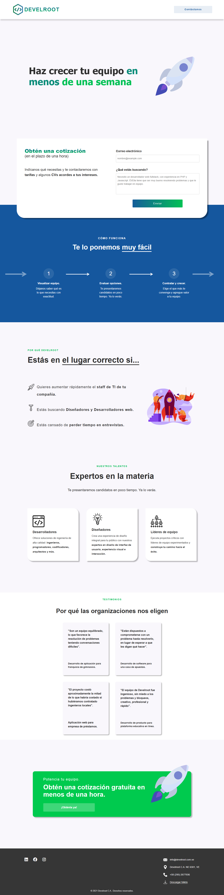

# Develroot Webpage

**Note:** This webpage was created as a University assignment and is not an official webpage for Develroot.

This is a webpage for Develroot, a company specializing in IT staffing solutions. The webpage provides information about the company, its services, and how to get in touch.

## Table of contents

- [Overview](#overview)
  - [Screenshot](#screenshot)
  - [Links](#links)
- [Process](#process)
  - [Project Structure](#project-structure)
  - [Technologies Used](#technologies-used)
  - [What I learned](#what-i-learned)
  - [Continued development](#continued-development)

## Overview

### Screenshot

### Links

- Live Site URL: [Develroot Webpage](https://gustavo2023.github.io/develroot-webpage/)
- Code: [Github Repository](https://github.com/gustavo2023/develroot-webpage)

## Process

### Project Structure

- **images/**: Contains all image assets used in the webpage.
- **index.html**: The main HTML file for the webpage.
- **styles.css**: The CSS file containing styles for the webpage.
- **assignment.pdf**: The PDF file containing the assignment details and requirements.

### Technologies Used

- HTML5
- CSS3
- JavaScript
- Font Awesome
- Mobile-first workflow

### What I learned

- Learned about effectively using CSS Flexbox and Grid to create flexible and responsive layouts.
- Incorporating external resources like Font Awesome for icons to add visual appeal and functionality to the webpage.
- Implementing media queries to ensure that the webpage looks good and functions as it should on different screen sizes.
- Recognized the importance of documentation for better project understanding and collaboration.

### Continued development

- Moving inline styles to external CSS file to improve code maintainability and readability.
- Using ARIA roles and properties to enhance the accessibility of interactive elements like buttons and navigation links.
- Optimize images for faster loading times by using the proper formats.
- Lazy loading images to improve initial page load performance.
- Add animations and transitions to make the webpage more engaging.
